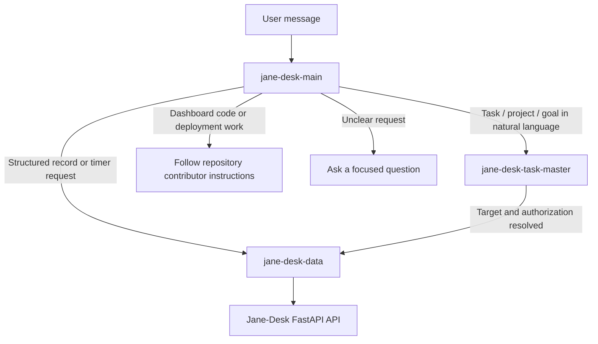
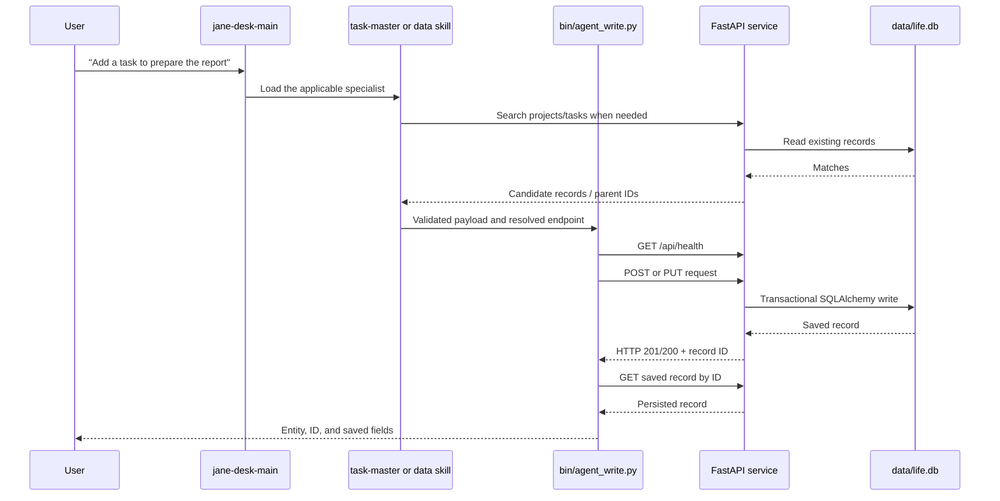
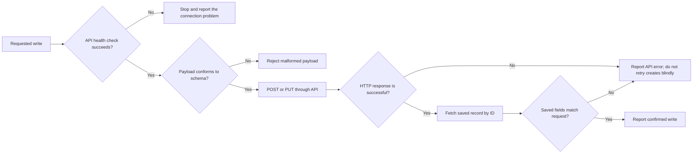
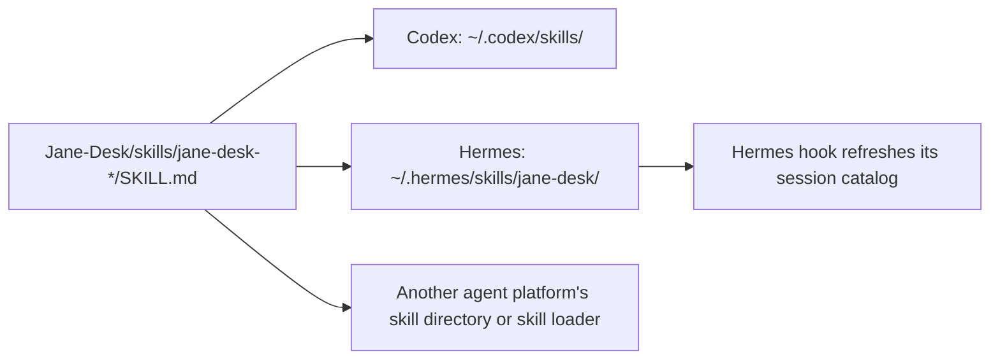

# Jane-Desk Agent Skills Explained

This document explains how Jane-Desk (also called Life-at-a-Glance) gives AI agents a safe, consistent way to add and update dashboard data.

The short version: an agent receives a dashboard-related request, starts with the **main skill**, loads a more specific skill, and writes only through the local FastAPI service. It never edits the SQLite database file directly.

## The pieces

```text
Jane-Desk/
├── AGENTS.md                         Repository-wide safety and API guidance
├── bin/
│   ├── agent_write.py                Guarded API writer used by agents
│   └── check_payloads.py             Schema guard for task/project/goal JSON
├── app/                              FastAPI application and SQLAlchemy models
├── data/life.db                      SQLite data store — API owns this file
└── skills/                           Source-controlled, cross-agent skill bundle
    ├── jane-desk-main/SKILL.md       Primary entry point
    ├── jane-desk-task-master/SKILL.md Natural-language task/project/goal handling
    ├── jane-desk-data/SKILL.md       API endpoints, validation, verification
    ├── jane-desk-router/SKILL.md     Backwards-compatible entry alias
    ├── install.sh                    Codex/Hermes installer
    └── hermes/                       Hermes session-start hook
```

`skills/` is the canonical source bundle. The installed copies in an agent's own skill directory are disposable copies and can always be refreshed by running the installer again.

## Skill hierarchy

`jane-desk-main` is the entry point for every agent integration. It avoids giving every agent every detail up front: the main skill decides which specialist should be read next.



### `jane-desk-main`

This is the only skill a third-party agent needs to know initially. It identifies whether the request is:

- natural-language planning or task management;
- a structured data operation;
- time tracking;
- application development rather than data entry; or
- too ambiguous to act on.

It then tells the agent which sibling skill to read. If an agent platform cannot load skills by name, it can read the indicated sibling `SKILL.md` from the installed bundle directory.

### `jane-desk-task-master`

This specialist interprets natural language for tasks, projects, and goals. It decides whether the request is a new record or an update, searches for a matching existing record, and requires clarification whenever the target or a task's parent project is ambiguous.

It does not write data itself. Once the intended operation is clear and authorized, it hands off to `jane-desk-data`.

### `jane-desk-data`

This specialist knows the API contract and the safe write procedure. It selects the endpoint, validates the payload, calls the API, and verifies that the API stored the requested fields.

### `jane-desk-router`

This is a compatibility alias for earlier integrations. It immediately redirects agents to `jane-desk-main`. New setups should start with `jane-desk-main`.

## How a request becomes dashboard data



The important boundary is the final one: only the FastAPI application writes to `data/life.db`. Agents interact with the API, not SQLite.

## Guardrails that prevent bad writes



`bin/agent_write.py` implements this flow for creates and updates. For tasks, projects, and goals it calls `bin/check_payloads.py` first. That checker rejects unsupported field names, invalid statuses, invalid dates, empty titles, and values such as `N/A` that should have been omitted.

## Entity locations and endpoints

All URLs are relative to `http://127.0.0.1:8000/api` by default. Set `LIFE_DASH_URL` when an agent must reach the service at another address.

| Entity | Create | Update | Important detail |
| --- | --- | --- | --- |
| Project | `POST /projects` | `PUT /projects/{id}` | Projects can contain tasks. |
| Task | `POST /projects/{project_id}/tasks` | `PUT /tasks/{id}` | The parent project ID goes in the URL, not the JSON body. |
| Goal | `POST /goals` | `PUT /goals/{id}` | Goals have an area and progress. |
| Learning | `POST /learnings` | `PUT /learnings/{id}` | Used for short knowledge records. |
| Journal | `POST /journal` | `PUT /journal/{id}` | Used for milestones, notes, and reflections. |
| Note | `POST /notes` | `PUT /notes/{id}` | Used for free-form notes. |

Task-specific actions use dedicated endpoints:

- Start work: `POST /tasks/{id}/start`
- Start a timer: `POST /tasks/{id}/sessions/start`
- Mark done: `PATCH /tasks/{id}/status?status=done`

## Installing the bundle

The bundle uses a portable layout: each native skill is a directory with a `SKILL.md` file. That is a common convention, but each agent product decides where to place or index those directories.



From the Jane-Desk repository root:

```bash
# Codex
skills/install.sh codex

# Hermes: installs the same skill folders and the bundled session-start hook
skills/install.sh hermes

# Both
skills/install.sh all
```

For another agent product, copy the four `skills/jane-desk-*/` directories into that product's documented skill location, preserving the directory names and `SKILL.md` files. Configure its routing/agent instructions to load `jane-desk-main` first for Jane-Desk requests. No product-specific database credentials are needed: the skills use the same local API contract.

After installing on a platform that caches skills, start a new conversation or reload its skill index. For Hermes, restart its gateway:

```bash
hermes gateway restart
```

## Examples

### A direct structured request

> Add a planned task called “Draft homepage copy” to project 12.

1. `jane-desk-main` routes to `jane-desk-data`.
2. The data skill checks that project `12` exists and searches for duplicate tasks.
3. It writes with:

   ```bash
   bin/agent_write.py task 12 '{"title":"Draft homepage copy","status":"planned"}'
   ```

4. The writer verifies the saved task and reports its ID.

### A natural-language update

> I finished drafting the homepage copy.

1. `jane-desk-main` routes to `jane-desk-task-master`.
2. It searches for a task with that title.
3. With exactly one matching record, it passes the resolved ID to `jane-desk-data`.
4. The data skill uses the status endpoint and verifies that the task is now `done`.

If the search finds multiple plausible tasks, the agent asks which one you mean instead of updating a random record.

## Maintaining the system

- Edit the source skills in `Jane-Desk/skills/`, not the installed copies in an agent's home directory.
- Run `skills/install.sh codex`, `hermes`, or `all` after changing the source bundle.
- Keep `AGENTS.md`, `skills/jane-desk-data/references/api-contract.md`, and the actual FastAPI routes aligned when the API changes.
- Run the skill validator after changing a skill:

  ```bash
  python3 /home/ubuntu/.codex/skills/.system/skill-creator/scripts/quick_validate.py \
    skills/jane-desk-main
  ```

- Start the FastAPI service before an agent attempts a write. If it is down, the guarded writer stops safely rather than touching the database file.

## Why this design is useful

The main skill provides a single, stable integration point for many agent products. Specialists keep the instructions focused, and the guarded writer makes the actual database update observable and verifiable. This separation lets you add another specialist later—such as calendar ingestion or analytics—without teaching every agent the entire system at once.
